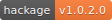

# awesome-badges

A collection of interesting badges I have found on GitHub and around the web.

Please add any new and interesting finds!

<section>

<table>

<tbody>

<tr>

<td></td>

<td></td>
eeeeeeeeee
<td></td>
s
</tr>

<tr>

<td></td>

<td></td>

<td></td>

</tr>

<tr>

<td></td>

<td></td>

<td></td>

</tr>

<tr>

<td></td>

<td></td>

<td></td>

</tr>

<tr>

<td></td>

<td></td>

<td></td>

</tr>

<tr>

<td></td>

<td></td>

<td></td>

</tr>

<tr>

<td></td>

<td></td>

<td></td>

</tr>

</tbody>

</table>

</section>

<section>

# Other interesting styles

</section>

